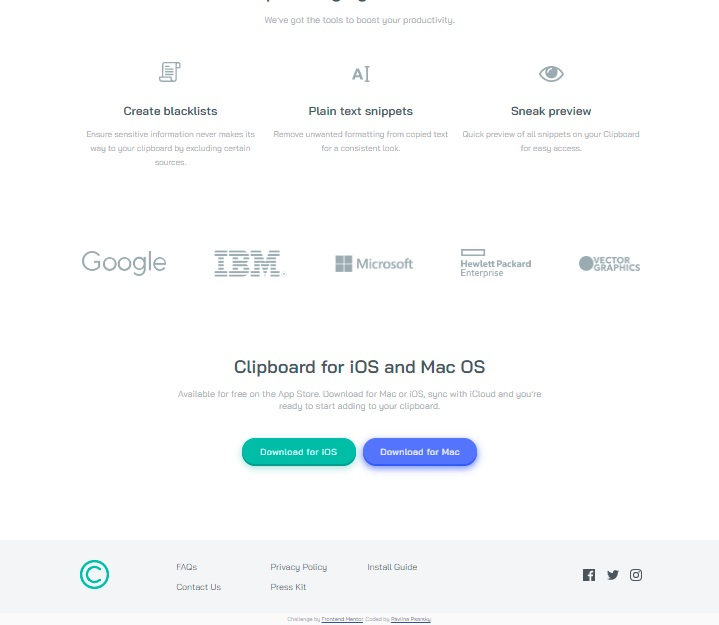

# Frontend Mentor - Clipboard landing page solution

This is a solution to the [Clipboard landing page challenge on Frontend Mentor](https://www.frontendmentor.io/challenges/clipboard-landing-page-5cc9bccd6c4c91111378ecb9). Frontend Mentor challenges help you improve your coding skills by building realistic projects. 

## Table of contents

- [Overview](#overview)
  - [The challenge](#the-challenge)
  - [Screenshot](#screenshot)
  - [Links](#links)
- [My process](#my-process)
  - [Built with](#built-with)
  - [What I learned](#what-i-learned)
  - [Continued development](#continued-development)
- [Author](#author)
- [Acknowledgments](#acknowledgments)

## Overview

### The challenge

Users should be able to:

- View the optimal layout for the site depending on their device's screen size
- See hover states for all interactive elements on the page

### Screenshot

| Desktop layout |
|:--:|
 

| Mobile layout |
|:--:|
 

### Links

- Solution URL: https://github.com/PavlinaPs/clipboard-landing-page
- Live Site URL: https://pavlinaps.github.io/clipboard-landing-page/

## My process

### Built with

- Semantic HTML5 markup
- CSS custom properties
- Flexbox
- CSS Grid
- Mobile-first workflow
- Sass
- BEM

### What I learned

- I applied align-items: baseline; for the first time and it works great!
```css
.supercharge__grid-container {
    @media (min-width: $desktop) {
        ..
        display: grid;
        grid-template-columns: repeat(3, 1fr);
        align-items: baseline;
        gap: 2.5rem;
    }
}
```

- I can set background-size separately for x and y axis:
```css
.landing__intro {
    ..
    background-color: var(--clr-white);
    background-image: url(/images/bg-header-mobile.png);
    background-position: center top;
    background-size: 100% 30rem;
    background-repeat: no-repeat;
    ..
}
```

- And finally, I am starting to think, that it is better to set padding-top to separate the sections than margin-top. The reason why is that I needed to add some background color on the body, because in the desktop layout for screens bigger than 144rem (what I set as max-width) the computer image would end abruptly as it is spilling out of the layout. Then I needed to add white background to each of the sections and with margin-top I could see the body background color between sections.

### Continued development

Social links

As I have been getting these weird html validation errors coming with font awesome, I set the social icons as \<svg>s this time. It needed to change color on hover, I simply changed the svg's fill color. 

I still don't know if it is the best solution how to code social links, I will keep looking for the best solution and experimenting in next layouts. Because today, social links are in almost every layout.

## Author

- GitHub - [PavlinaPs](https://github.com/PavlinaPs)
- Frontend Mentor - [@PavlinaPs](https://www.frontendmentor.io/profile/PavlinaPs)

## Acknowledgments

It is great that I can solve Frontend Mentor's challenges. They are all very useful for me. Every single one. Thank you!
